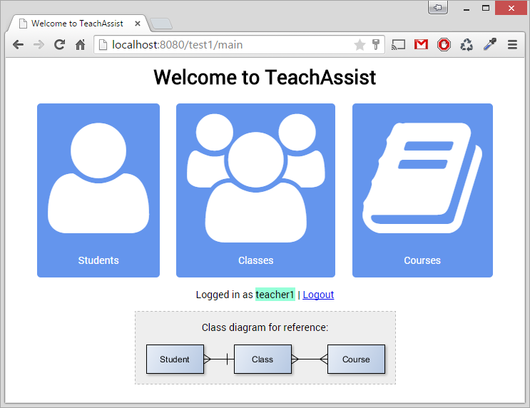

# Teacher-Assistant

This is a module of our project. Two of the requirements in our specification were:

* Teacher can login with user/passwd.
* Teacher or another higher user role can create a register of classes, courses and students.

These are the requirements we have implemented.

These frameworks are a part of the application:

* Spring MVC as a base framework and design pattern
* Hibernate for data management
* Spring Security for authentication
* jQuery for client validation and AJAX requests

**For a list of dependencies please see [pom.xml](pom.xml).**

## Setup

**Only tested on glassfish 4**

1. Make sure you are on HiOA WAN or VPN (required to access database). \*\*if you don't have access to HiOA network please see [this page](setup-database.md)

2. Download [test1.war](target/test1.war) save to glassfish\bin\test1.war

3. Start glassfish: run **'glassfish\bin\asadmin'** from command-line then run **'asadmin> start-domain domain1'**

4. Deploy Teacher-Assistant: run **'asadmin> deploy test1.war'**

5. Open **localhost:8080/test1** in browser and login with username **'teacher1'** and password **'leet'**

Screenshot from front page.

## Created by

* [s198734 Ali El Hatri](mailto:s198734@stud.hioa.no)
* [s181142 Akil Asghar](mailto:s181142@stud.hioa.no) [2](mailto:mail@asghara.com)
* [s181322 Joakim Magnussen](mailto:s181322@stud.hioa.no) [2](mailto:joakim-m@outlook.com)

Since we all check our mails at different time of day, please e-mail all three if there is a problem with the app.

This application was made possible with these tutorials

* [Getting Started with Spring MVC, Hibernate and JSON](https://confluence.jetbrains.com/display/IntelliJIDEA/Getting+Started+with+Spring+MVC,+Hibernate+and+JSON)
* [Spring Security Form Login Using Database](http://www.mkyong.com/spring-security/spring-security-form-login-using-database/)
* [Hibernate Many To Many Annotation Mapping Tutorial](http://viralpatel.net/blogs/hibernate-many-to-many-annotation-mapping-tutorial/)
